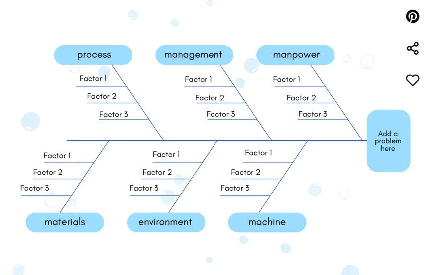

# 
Dental Public Health

## Teori Pencegahan Leavell & Clark

Menurut **Leavell & Clark**, terdapat 3 teori pencegahan: Primary, Secondary, dan Tertiary:

- **Primary**

	- **Health Promotion (Promosi kesehatan)**
		- Yaitu merupakan promosi kesehatan, seperti penyuluhan, dan edukasi kesehatan gigi (DHE/Dental Health Education).
	- **Specific Treatment (Perawatan spesifik)**
		- Hal-hal yang dilakukan untuk memproteksi masyarakat dari masalah-masalah gigi. Contoh: TAF, PFS, vaksinasi, sikat gigi, pembuatan SM pasif, pemberian fluor.

- **Secondary**

	- **Early Diagnosis & Prompt Treatement (Diagnosis dini & perawatan segera)**
		- Dilakukan untuk mendapatkan diagnosis sesegera mungkin dan melakukan perawatan sesegera mungkin untuk kasus yang didapatkan. Contoh hal-hal yang dilakukan seperti oral diagnosis, penambalan, scaling-root planing, dan PRR/preventive resin restoration
	- **Disability Limitation (Pembatasan disabilitas)**
		- Berarti dimana masalah dental sudah terjadi namun belum terlalu parah dan masih bisa dilakukan pengurangan keparahan. Contoh: Pencabutan untuk gigi-gigi sisa akar, splinting untuk kasus-kasus kegoyangan gigi, dan juga perawatan ortodonti korektif untuk memperbaiki oklusi.

- **Tertiary**

	- **Rehabilitation (Rehabilitasi)**
		- Masalah dental sudah terjadi dan sudah terlalu parah, dan sudah final, seperti kasus kehilangan gigi. Contoh perawatan yang dilakukan disini yaitu seperti pembuatan gigi tiruan.

- Terdapat 3 jenis perawatan ortodonti:
	- **Preventif**: Berarti mencegah. Contoh: Pembuatan space maintainer yang dimana maloklusi belum terjadi namun berpotensi terjadi
	- **Interseptif**: Dimana maloklusi telah terjadi, dan tujuan dilakukan perawatan ortodonti yaitu mengintersepsi maloklusi yang terjadi. **Biasa dilakukan pada tahap tumbuh kembang**
	- **Korektif**: Yang berarti memperbaiki. Disini maloklusi sudah terjadi dan penderita sudah dewasa/tidak di tahap tumbuh kembang lagi

## Teori Lawrence Green

Terdapat 3 item:

- Predisposing:
	- Faktor predisposisi
	- Perilaku masyarakat yaitu dari diri sendiri, dari pengetahuan sendiri.
- Enabling:
	- Faktor pendukung
	- Perilaku didapatkan dari lingkungan fisik, seperti sekolah dan perkumpulan
- Reinforcing
	- Faktor pemerkuat
	- Perilaku didapat dari tokoh-tokoh yang dipercaya oleh masyarakat, seperti dari keluarganya atau tokoh masyarakat

## Teori Blum

4 item:

- Gaya hidup
- Pelayanan kesehatan
- Lingkungan
- Genetik

---

## Fungsi Rekam Medis

- Administrative value
	- Pengarsipan & penyimpanan
- Legal
	- Untuk keperluan hukum
- Financial
	- Keperluan finansial, untuk menentukan biaya perawatan dsb.
- Educational
	- Berguna untuk edukasi, bisa digunakan sebagai bahan penelitian
- Documentary
	- Untuk dokumentasi; berguna untuk perihal pertanggungjawaban
- Medical
	- Untuk merencanakan perawatan yang akan dilakukan

---

## Puskesmas

- Permenkes No. 43 Tahun 2019: Perundang-undangan yang mengatur tentang puskesmas
- Upaya kesehatan wajib untuk puskesmas:
	- Promkes
	- Kesling
	- KIA
	- P2P
	- Gizi
	- Pengobatan dasar
- Upaya kesehatan pengembangan
	- UKS/UKGS
		- I - Minimal: Guru olahraga
		- II - Standar: Ada tenaga medis, namun tanpa perawatan
		- III - Optimal: Ada tenaga medis juga, namun perawatan sudah ada (Treatment needed)

---

## Strategi Promkes

- Advocacy (advokasi)
	- Memakai pembuat kebijakan, seperti ketua RT/RW, kelurahan, dsb.
- Social support (dukungan sosial)
	- Memakai tokoh masyarakat
- Empowerment (pemberdayaan)

	- Langsung ke masyarakatnya

	***

## Studi epidemiologi

- Analitik:
	- Cross sectional
		- Penelitian singkat dan bisa langsung selesai (speedrun)
	- Cohort
		- Prospektif, maju ke depan; lama karena dibutuhkan waktu
	- Case Control
		- Retrospektif, mundur ke belakang

---

## Tabel Jenis & Metode Pengujian

| Jenis Pengujian																| Metode Parametrik														| Metode Nonparametrik																																													 |
| ---------------------------------------------- | -------------------------------------------- | -------------------------------------------------------------------------------------------------------------- |
| Perbedaan 2 mean, data independen (beda orang) | Student t test															 | **U Mann-Whitney Test** Wilcoxon Rank Sum Test Wald-Wolfowitz Run Test																	 |
| Perbedaan 2 mean, data dependen								| Paired t test																| Wilcoxon Signed Rank Test Sign Test																																				 |
| Perbedaan 2 proporsi (perbedaan persentase)		| Z test for difference between two proportion | Chi-square test **Fisher Exact Probability Test** McNemar Test																					 |
| Perbedaan 3 mean atau lebih										| Anova																				| **Kruskal Wallis Anova by Rank** Friedman Test																															|
| Hubungan																			 | Pearson/Regression and Correlation					 | **Spearman Rank Correlation** Kendall Tau Correlation Kendal Concordance Test Contingency Coefficient |

---

## Rujukan umum

- Rujukan internal
	- Rujukan horizontal
	- Ke dokter sejawat
- Rujuka eksternal
	- Rujukan vertikal
	- Dari puskesmas ke RS tipe C
- Rujukan medis
	- Pemeriksaan penunjang

## Rujukan dari keluarga

- Interval referral
	- Dalam jangka waktu tertentu
- Collateral referral
	- 1 kasus saja
- Cross referral

	- Untuk semua kasus

	***

## Jenis Rumah Sakit

- Rumah sakit tipe A: Provinsi
- Rumah sakit tipe B: Kota
- Rumah sakit tipe C: Kabupaten
- Rumah sakit tipe D: Kecamatan (Puskesmas)
- Rumah sakit tipe E: Rumah sakit khusus

	***

- DMFT
	- Decay-Missing-Filled Teeth
	- Untuk masyarakat dewasa
- DMFS
	- Decay-Missing-Filled Surface
- deft
	- Decay-Extracted-Filled Teeth
	- Untuk anak-anak

---

## Teknik Sikat Gigi

- Horizontal Scrub
	- Biasa dilakukan oleh yang tidak familiar dengan metode lainnya
- Bass
	- Untuk interproksimal, servikal, permukaan email dan akar yang terbuka; untuk **jaringan periodontal yang sehat**
- Stillman
	- Pada kasus **resesi gingiva**
- Charter
	- Untuk pasien dengan ortodonti cekat, resesi gingiva moderate, dan **pasca operasi periodontal**
- Fones/Rolling stroke

	- Untuk **anak-anak 3-5 tahun** atau yang hanya memiliki gigi susu

	***

## Penentuan prioritas masalah/program

- Nomina Group Technique
	- Voting
- USG
	- Urgency, Seriousness, Growth
		- U: Kegawatdaruratan
		- S: % kematian
		- G: Penularan

| Masalah	 | U	 | S	 | G	 | Total |
| --------- | --- | --- | --- | ----- |
| Masalah A | 2	 | 5	 | 2	 | 10		|
| Masalah B | 3	 | 1	 | 3	 | 7		 |

- Fishbone - Bagan
	

- Delbeque
	- Panel ahli
- CARL
	- Capability, Accessibility, Readiness, Leverage
- MCUA
	- Multiple Criteria Utility Assesment
- PAHO
	- Magnitude, Severity, Vulnerability, Community concern

---

- Klinik Pratama
	- Dokter umum DAN dokter gigi
- Klinik Mandiri
	- Dokter umum ATAU dokter gigi
