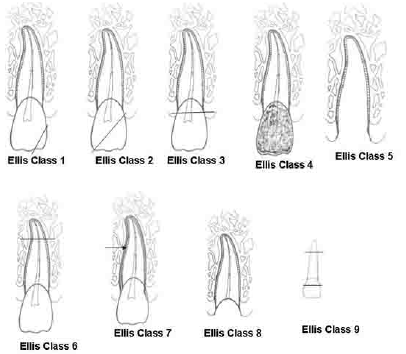

# 
IKGA

[toc]

---

## Tahap tumbuh kembang

1.  Inisiasi - mgg. 8
2.  Proliferasi *(Bud stage)* - mgg. 9-10
3.  Histodiferensiasi *(Cap stage)* - mgg 11-12
4.  Morfodiferensiasi *(Bell stage)* - Bentuk anatomi gigi
5.  Aposisi - Matriks jar. keras gigi
6.  Erupsi

### Gangguan tahap inisiasi

Gangguan inisiasi merupakan **gangguan dimana ada gigi ekstra**

- Mesiodens
    
    - Diantara gigi 11 & 21; peg-shaped
- Laterodens
    
    - Distal gigi 11 & 21; peg shaped
- Paramolar
    
    - Sering disebut premolar 3
- Distomolar
    
    - Sering disebut molar 4
- Perawatan: Exo
    

### Gangguan tahap proliferasi

Di tahap proliferasi yaitu **gangguan jumlah benih gigi**

- Anodonsia
    - Tidak ada **benih gigi sama sekali**
- Hipodonsia
    - Tidak ada **1-6 benih gigi**
- Oligodonsia
    - Tidak ada **6 benih gigi**

### Gangguan tahap histodiferensiasi

- Regional odontodysplasia
    - Gangguan genesis email, dentin, dan pulpa

### Gangguan tahap morfodiferensiasi

Gangguan disini merupaka dalam bentuk gigi

- Makrodontia
    - Gigi besar
- Mikrodontia
    - Gigi kecil
- Fusion
    - 2 saluran akar, 2 mahkota
    - Menyatu di sementum
- Geminasi
    - 2 mahkota, 1 saluran akar
- Hutchinson's & Mulberry
    - Dikarenakan peny. sifilis; oleh bakteri Treponema
- Dilaserasi
    - Apex gigi bengkok
- Concrescence
    - Penyatuan 2 akar
- Taurodontia
    - Kamar pulpa yang besar

### Gangguan tahap aposisi

Gangguan pada email dan dentin

- Enamel hypoplasia
    - Berwarna kecoklatan
    - Dikarenakan antibiotik
- Dentin dysplasia
    - Akar gigi pendek
- Amelogenesis imperfecta
    - Karena keturunan
    - **Warna kuning kecoklatan, garis di email**
- Dentinogenesis imperfecta
    - Karena keturunan
    - Gigi berbentuk *bulbous*
    - Berwarna **keabuan**
    - Beberapa tipe:
        - Tipe I: Disertai osteogenesis imperfecta (Ingat: Mr. Glass)
        - Tipe II: Tanpa osteogenesis imperfecta
        - Tipe III: Komunitas Brandywine, shell-teeth

* * *

## Klasifikasi trauma Ellis & Davey

- Klas I
    - Email
- Klas II
    - Dentin
- Klas III
    - Pulpa **vital**
- Klas IV
    - Pulpa **non-vital**
- Klas V
    - Avulsi/kehilangan gigi karena trauma
	- Where the fuck the teeth's gone to?
- Klas VI
	- Fraktur akar
- Klas VII
	- Gigi intrusi, ekstrusi, luksasi, ataupun subluksasi
	- Perubahan posisi gigi
- Kelas VIII
	- Total destruction en-masse
	- Kerusakan total mahkota
- Kelas IX
	- Trauma pada gigi sulung
 
---

## Perawatan gigi sulung

- Pulp capping
	- Dengan Ca(OH)~2~
	- Pulp capping direct
		- Untuk pulpa pinpoint (&lt;1mm)
		- Menghasilkan **dentin reparatif**
	- Pulp capping indirect
		- Untuk selapis tipis dentin
		- Menghasilkan **dentin reaksioner**
- Pulpotomi
	- Jika resorpsi akar sudah diatas 1/3
	- Tidak ada keluhan sakit
	- Pulpotomi vital & nonvital
		- Menggunakan ZnOE + formokresol
	- Pulpotomi devital
		- Jika pasien tidak kooperatif
		- Bahan devitalisasi pulpa: **Paraformaldehyde paste**
		- Juga menggunakan ZnOE + formokresol
- Pulpektomi
	- Jika resorpsi akar masih dibawah 1/3
	- Ada keluhan sakit
	- Pulpektomi vital, nonvital, dan devital: Menggunakan ZnOE

> ⚠️ Lihat resorpsi untuk menentukan pulpotomi atau pulpektomi!

- Ferric sulfate: Agen hemostasis/penghenti perdarahan

## Perawatan gigi permanen muda

- Pulp capping
	- Dengan Ca(OH)~2~
- Apeksogenesis
	- ⚠️ **Untuk gigi vital** ⚠️
	- Bahan: Ca(OH)~2~
	- == Pulpotomi Ca(OH)~2~
- Apeksifikasi
	- ⚠️ **Untuk gigi nonvital** ⚠️
	- Bahan: Ca(OH)~2~
	- Revaskularisasi
- Avulsi gigi permanen
	- Golden period: 1-2 jam
	- Jika masih dalam golden period: **Replantasi**
	- Diluar: **PSA**
- Gigi intrusi
	- Observasi selama 3-4 mgg.
	- Jika tidak ada perubahan &rarr; Reposisi

---

## Space maintainer

- Band/crown loop
	- Jenis semi-fixed
	- Untuk pemeliharaan ruang di posterior
- Distal shoe
	- Jika m2 sulung premature loss dan M1 permanen belum erupsi
- Space maintainer aktif
	- Jika terdapat diskrepansi ruang
	- Space regainer
- Untuk pasien Bell's palsy
	- Fixed Lingual Arch
 
---

## Klasifikasi tingkah laku anak Frankl

1. Very negative
	- Menolak perawatan; menangis keras
2. Negative
	- Tindakan negatif minor; gugup atau menangis kecil
3. Positive
	- Berhati-hati; segan bertanya; tidak menolak petunjuk drg.
4. Very positive
	- *The best*

## Klasifikasi tingkah laku anak Wright

- Kooperatif
	- Tenang
- Tidak mampu kooperatif
	- Anak &lt;3th
	- Anak berkebutuhan khusus
- Berpotensi kooperatif
	- Butuh pendekatan

## Klasifikasi tingkah laku anak White

- Koop
- Tak mampu koop
- Histeris
- Defiant/Keras kepala
- Timid/Pemalu
- Tense/Tegang
- Whining/Cengeng

## Metode pendekatan

- Desensitisasi
	- Pendekatan secara perlahan
- Modelling
	- Memberikan contoh, biasa dari anggota keluarga yang lebih dewasa
- Distraksi
	- Memberikan pengalih perhatian (eg. tontonan)
- Reinforcement
	- Memberikan hadiah
- HOME
	- Untuk pasien histeris
- Restraint
	- Untuk kasus gawat darurat
- TSD (Tell-show-do)

---

- Posisi perawatan terbaik untuk KGA
	- Lap to lap position/Knee to knee position
 
---

- Rule of 10 untuk perawatan sumbing
	- 10 weeks of age **(Umur 10 minggu)**
	- 10lbs of weight **(Berat badan 10 pon)**
	- 10 g/dL of haemoglobin **(Hb darah 10g/dL)**
	- &lt;10,000/mm^3^ count of white blood cell **(Sel darah putih &lt;10,0000/mm^3^)**