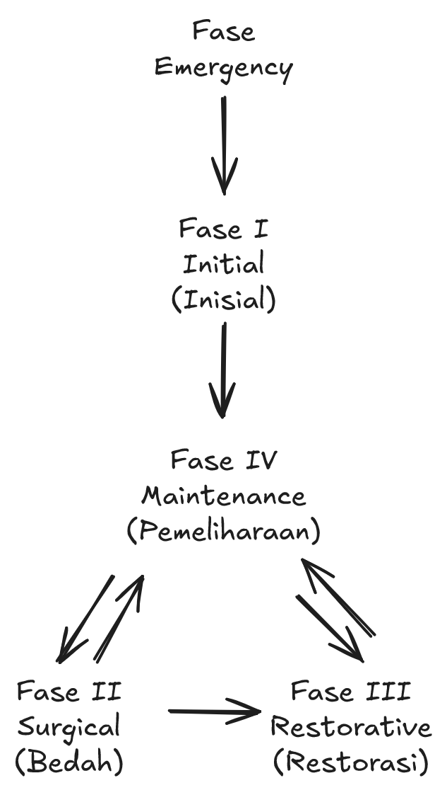
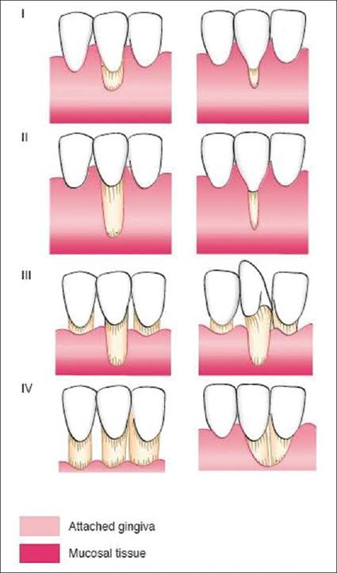
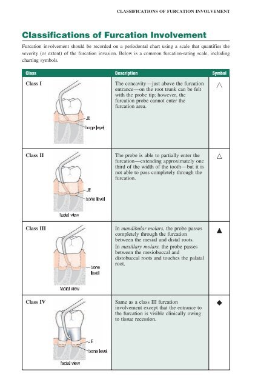

# 
Periodonsia

## Gingivitis

- Gingivitis kronis
	- Poket relatif/pseudopoket
	- Tidak ada kehilangan perlekatan
	- Bakteri: Porphyromonas gingivalis
- Gingivitis akut **(ANUG)**
	- Lapisan pseudomembran **keabuan**
	- Crater-like
	- Bau besi
	- Tidak ada kerusakan tulang
	- Bakteri: Fusobacterium nucleatum & Spirochaeta
	- Perawatan:
		- Debridement dengan H~2~O~2~ atau saline
		- Metronidazole

## Periodontitis

- Periodontitis kronis
	- Poket absolut/true pocket
	- Ada kehilangan perlekatan
	- Usia &gt;35th
- Periodontitis akut (ANUP)
	- Sama dengan ANUG
	- Ada kerusakan tulang
- Periodontitis agresif
	- Lokalis: &lt;2 gigi; Generalis: &gt;2 gigi
	- Usia maksimal 35th
	- OH baik-sedang
	- Poket infrabony
	- Mengenai gigi I & M1
	- Tidak ada peny. sistemik (Jika ada & penderita muda: kronis)
	- Karena keturunan
	- Bakteri: Aggregatibacter actinomycetemcomitans
- Menentukan generalis atau lokalis: Gigi yang terkena 30%
	- Dibawah 30% yang terkena
		- Lokalis
	- Diatas 30%
		- Generalis

---

## Fase perawatan

- Fase emergency
	- Abses gingiva & abses periodontal: Insisi & drainase
	- Operkulektomi
	- Necrotizing periodontic disease (ANUG & ANUP): Debridement
	- Acute herpetic gingivostomatitis: Premedikasi
	- Hopeless tooth (minimal 2 kriteria): Ekstraksi
	- Gigi yang menyebabkan rasa sakit
- Fase I - Inisial
	- DHE dan OHI
	- Gingivitis: Scaling, root planing, polishing
	- Gigi mobilitas: Splinting temporary
	- Traumatik oklusi: Occlusal adjustment
	- Karies: Tambal sementara
- Fase II - Bedah
	- Gingivektomi: Poket (+), bengkak
	- Kuretase: Poket (-)(&lt;5mm), bengkak
	- Gingivoplasti: Untuk tepi gingiva yang tidak rata
	- Bedah flap: Poket &gt;6mm
	- ENAP (Open curretage): Excision for New Attachment Procedure
- Fase III - Restoratif
	- Restorasi akhir
	- Splinting permanen
	- Pembuatan GTC, GTSL, GTP
- Fase IV - Pemeliharaan
	- OHI-S
	- Pemeriksaan gingiva (probing, pemeriksaan inflamasi)
	- Pemeriksaan oklusi, kegoyangan gigi, kondisi patologis

---

## Enlargement gingiva

- 0
	- Tidak ada pembesaran
- 1
	- Pembesaran di interdental
- 2
	- Pada interdental & margin
- 3
	- Hingga mahkota
 - Obat penyebab
	 - Phenytoin (Antikonvulsan; penderita epilepsi)
	 - Amlodipine (Antihipertensi; penderita darah tinggi)
	 - Cyclosporine (Immunosuppresant; penerima transplantasi)

## Resesi

- Perawatan: Coronally Reposition Flap (Termasuk ke Fase II)
- Pengukuran menggunakan probe UNC 15
- Klas I
	- Belum meluas ke mukogingiva
- Klas II
	- Meluas ke mukogingiva, namun interdental masih utuh
- Klas III
	- Meluas ke mukogingiva dan interdental terlibat
- Klas IV
	- Kerusakan tulang dan malposisi geligi
 
## Lesi furkasi

- Pengukuran menggunakan probe Nabers
- Grade I
	- Tidak ada perubahan secara radiografi
	- Perawatan: SRP
- Grade II
	- Cul-de-sac; probe tertanam di tulang
	- Debridement
- Grade III
	- Probe tertanam di jar. lunak; tulang tidak melekat di furkasi
	- Bone graft
- Grade IV
	- Through-and-through