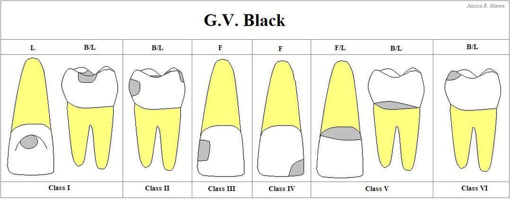
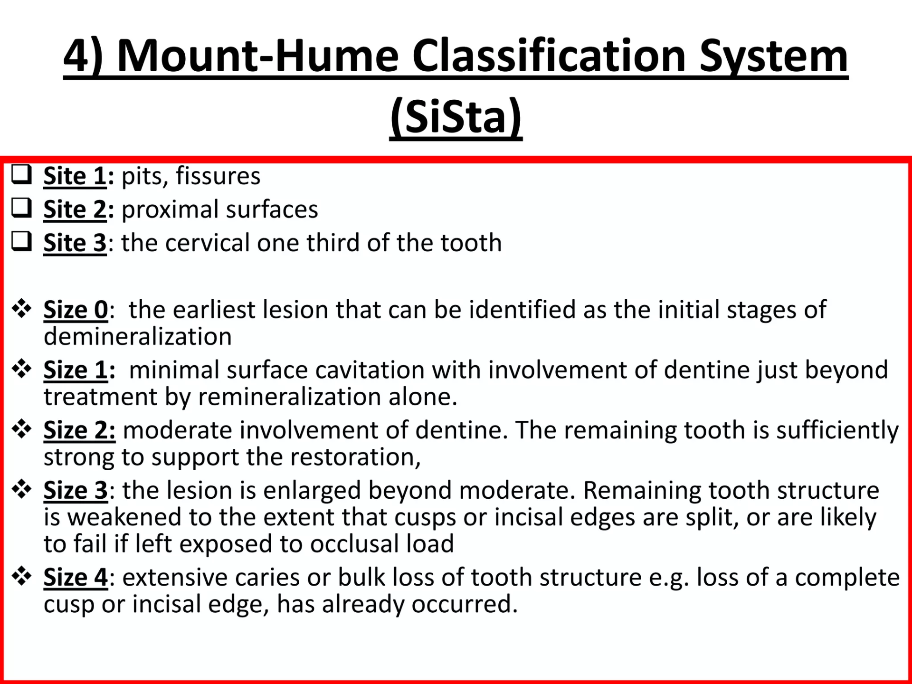
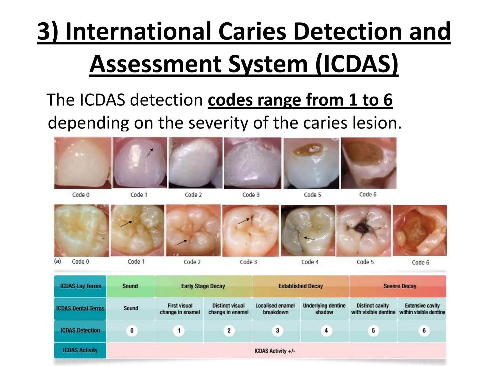

# 
Konservasi

[toc]

---

## Klasifikasi Karies

### GV Black

- Kelas I: Pit & fissure; oklusal gigi post.
- Kelas II: Proksimal gigi post.
- Kelas III: Proksimal gigi ante.; belum mengenai insisal
- Kelas IV: Proksimal gigi ante.; sudah mengenai insisal
- Kelas V: Servikal gigi
- Kelas VI: Ujung cusp/incisal edge

### Mount & Hume

- Dibagi menjadi **Site** (situs) dan **Size** (ukuran)
- Site:
	- Site 1 - Pit & fissure
	- Site 2 - Permukaan proksimal
	- Site 3 - Servikal
- Size:
	- Size 0 - White spot
	- Size 1 - Enamel 
	- Size 2 - Dentin
	- Size 3 - Mengenai 1 cusp
	- Size 4 - Mengenai > 1 cusp

### ICDAS (International Caries Detection & Assessment System)

- D0 - Tidak ada lesi
- D1 - Lesi kering
- D2 - Lesi basah
- D3 - Email
- D4 - Dentinoenamel junction
- D5 - Dentin besar
- D6 - Pulpa

## Etiologi karies

1. Host
2. Mikroorganisme
3. Waktu
4. Subtrat

Mikroorganisme

- Email - Dentin pionir &rarr; Streptococcus sanguinis
- Email - Dentin dominan &rarr; Streptococcus mutans; Lactobacillus
- Karies pulpa &rarr; Enterococcus faecalis
- Abses &rarr; Staphylococcus aureus

## Diagnosa AAE
**
- *Diagnosis pada **pulpa***
	- Pulpa normal
	- Pulpitis reversibel &rarr; Dentin
		- Sakit **dengan** rangsangan
		- Syaraf A delta
	- Pulpitis irreversibel &rarr; Pulpa
		- Sakit **tanpa** rangsangan
		- Syaraf C unmyelin
		- *Simptomatik*
			- Keluhan sakit (+)
		- *Asimptomatik*
			- Keluhan sakit (-)
			- Vitalitas (+)
	- Previously treated teeth
		- Pasca PSA dengan guttapercha
	- Previously initiated therapy
		- Pasca parsial endodontik (Pasca pulpotomi; PSA tidak diisi guttapercha)

> :warning: ***Diluar AAE:***
> - Pulpitis hiperplastik kronis &rarr; Polip pulpa
> - Pulpitis eksaserbasi akut &rarr; Sakit lagi; belum dilakukan PSA
	 
- *Diagnosis pada **periapikal***
	- Periapikal normal
	- Periodontitis apikalis &rarr; Pelebaran ligamen periodontal
		- Simptomatik: Sakit (+)
		- Asimptomatik: Tidak sakit, namun terdapat pelebaran lig. periodontal
	- Abses periapikal &rarr; Radiolusen diffuse
		- Akut: Sakit (+); Fistula (-) &rarr; Trepanasi
		- Kronis: Sakit (-); Fistula (+) &rarr; Drainase
	- Condensing osteitis &rarr; Radioopak diffuse
		- Respons tulang terhadap peny. endodontik

---

## PSA

- PSA vital
	- **Pulpektomi**
- PSA nonvital
	- **Perawatan saluran akar**
	- Endo intrakanal

---

## Bonding (Generasi adhesive)

- Bahan etsa &rarr; As. fosfat 37%
- Bahan bonding &rarr; As. poliakrilat 10%

 

- Generasi IV
	- Etsa, primer, adhesive
	- **Total etch 2 step**
- Generasi V
	- Etsa, **primer + adhesive**
	- **Total etch**
- Generasi VI
	- **Etsa + primer**, adhesive
	- **Self etch 2 step**
- Generasi VII
	- All in one (Etsa + primer + adhesive)
	- **Self etch**

---

## Klasifikasi Resin Komposit

- Terdapat **flowable** dan **packable**
- Berdasarkan filler:
	- Makrofil (&plusmn; 8&micro;m) &rarr; Gigi posterior
	- Mikrofil (0,01 - 0,04 &micro;m) &rarr; Gigi posterior, namun lebih estetis dibandingkan makrofil
	- Hybrid (0,4 - 1&micro;m) &rarr; Kelas III & IV
	- Nanofil (0,005 - 0,01&micro;m) &rarr; Klas IV
- Berdasarkan aktivator:
	- Light-cured
		- Activator: Amine
		- Initiator: Champorquinone
	- Self-cured
		- Activator: Amine
		- Initiator: Benzoyl peroxide

---

## Klasifikasi GIC

- Powder: Fluoroaminosilikat
- Liquid: As. poliakrilat

 

- Tipe I &rarr; Luting
- Tipe II &rarr; Restorasi
	- 2.1 - Anterior
	- 2.2 - Posterior
- Tipe III &rarr; Basis
	- 3.1 - Metal
	- 3.2 - Sandwich
- Tipe IV &rarr; Fissure sealant
- Tipe V &rarr; Sement ortodonti
- Tipe VI &rarr; Core build-up
- Tipe VII &rarr; Fluoride-releasing
- Tipe VIII &rarr; ART (Atraumatic restorative treatment/Restorasi atraumatik)
- Tipe IX &rarr; Gigi sulung

---

## extranotes, lmao

- Pasca PSA &rarr; Selalu pilih crown untuk restorasi akhir
	- Jika disebutkan kehilangan mahkota 1/3 &rarr; Pilih pasak