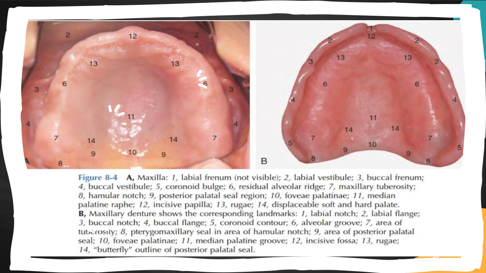
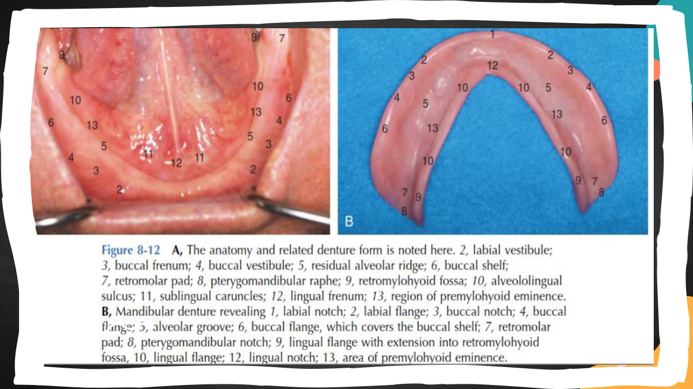

# 
Prostodonsia

[toc]

---

## Klasifikasi Kennedy

- Kelas I
	- Free end posterior bilateral (Belakang endentulous di kedua sisi)
- Kelas II
	- Free end posterior **unilateral** (Belakang edentulous hanya satu sisi)
- Kelas III
	- Saddle end posterior unilateral (Masing ada gigi dibelakangnya)
- Kelas IV
	- Anterior missing **yang melewati midline** (Gigi 11-21 atau 31-41 harus missing)

> :warning: Applegate sudah tidak dipakai &rarr; dikarenakan terlalu sulit untuk dihafal

### Rules untuk klasifikasi Kennedy

- Rule 2 &rarr; Jika M3 missing, **tidak ikut klasifikasi**
- Rule 4 &rarr; Jika M2 missing, **tidak ikut klasifikasi**
	- Dikarenakan M2 & M3 opsional
	- Yang jadi kunci klasifikasi &rarr; M1
- Rule 5 &rarr; Penentuan klasifikasi selalu dimulai dari posterior
- Rule 6 &rarr; Modifikasi ditentukan dari **jumlah ruang yang missing**
- Rule 8 &rarr; Kelas IV **tidak ada modifikasi**
	- Karena klasifikasi dimulai dari posterior &rarr; kembali ke rule 5
 
---

## Struktur pendukung & pembatas

- Maksila

- Mandibula

- :warning: Jika pasien merasakan sakit menggunakan GT &rarr; Incisivus papilla :warning:

## Stress-bearing area pada maksila & mandibula

- Maksila
	- 1&deg; Firm tuberosities
	- 1&deg; Hard palate
	- 2&deg; Alveolar ridge
	- 2&deg; Rugae
- Mandibula
	- 1&deg; Buccal shelves
	- 1&deg; Retromolar pad
	- 2&deg; Alveolar ridge

---

## Teknik pencetakan

- Mukostatis
	- Tekanan minim pada jaringan
	- Untuk mencat jaringan dalam keadaan istirahat
	- Untuk GTC, GTSL
		- Untuk **linggir yang tajam** 
- Mukokompresi
	- Memberi tekanan pada jaringan
	- Untuk linggir yang normal
- Mukofungsional :moyai:
	- Untuk mendapatkan peripheral seal
	- Untuk dukungan mukosa eg. **Border molding**
- Selective pressure :moyai:
	- Memilih daerah tekanan
	- Untuk mukosa flabby &rarr; ditekan di belakang yang flabby
	- Untuk tahanan jaringan yang berbeda

---

## GTKL - Gigi tiruan kerangka logam

- Maksila
	- Posterior palatal strap &rarr; Kelas I, II, & III Kennedy (Kondisi yang normal)
	- :moyai: Anteroposterior palatal strap &rarr; Torus palatinus kecil
	- :moyai: Palatal U-shape &rarr; Torus palatinus besar (Nama lain: Horseshoe)
- Mandibula
	- :moyai: Lingual bar &rarr; Ruang dasar mulut &ge; 6mm
	- Lingual plate &rarr; Tinggi dasar mulut &le; 5mm
	- :moyai: Double lingual bar &rarr; Terdapat kegoyangan di anterior
	- Labial bar &rarr;  Gigi anterior yang berinklinasi ke lingual
 
- Klamer GTKL
	- :moyai: RPI &rarr; Lengan lurus
	- :moyai: RPA &rarr;  Lengan miring
	- Circumferential clasp &rarr; Sama seperti klamer 3 jari GTSL
	- Embrassure clasp &rarr; Edentulous diantara 2 gigi

---

## GTC - Gigi tiruan cekat

Memiliki 3 komponen

- Retainer
	- Ekstrakorona &rarr; Abutment dibuatkan crown
	- Intrakorona &rarr; Abutment dibuatkan inlay/onlay
	- Intraradikuler &rarr;  Abutment dilakukan PSA terlebih dahulu, kemudian menggunakan pasak dowel
- Connector
	- Rigid &rarr; Untuk abutment yang tegak di linggir alveolar (Maksimal 10&deg;)
	- Non-rigid &rarr; Untuk abutment yang miring
- Pontic
	- :moyai: Sanitary &rarr; Posterior RB (Sisi lingual & bukal pontik tidak kontak)
	- Spheroidal &rarr; Anterior RB
	- Ridge lap &rarr; Anterior & posterior RA & RB
	- :moyai: Modified ridge lap &rarr; Untuk estetik; anterior RA
	- :moyai: Ovate &rarr; Untuk estetik; pasca pencabutan
	- :moyai: Conical root &rarr; Untuk linggir yang sempit
 

Jenis GTC

- Fixed-fixed &rarr; Kedua konektor rigid &rarr; Terbaik
- Semi-fixed &rarr; Salah satu konektor non-rigid
- Maryland/adhesive bridge &rarr; Gigi anterior; preparasi minimal
- Cantilever &rarr; GTC sederhana; 1 abutment
- Spring bridge &rarr; Abutment gigi posterior; pontik didukung oleh konektor panjang

---

## Akhiran servikal

- Chamfer &rarr; Untuk all porcelain (Karena mengutamakan estetik)
- Shoulder &rarr; PFM (Untuk retensi)

---

## Karakteristik pasien geriatri

- Philosophical mind &rarr; Kooperatif
- Exacting mind &rarr; Berawal tidak kooperatif, namun perlahan kooperatif (Dengan kata lain: Philosophical mind yang tertunda)
- Hysterical mind &rarr; Tidak kooperatif, banyak tuntutan dan kemauan
- Indifferent mind &rarr; Acuh