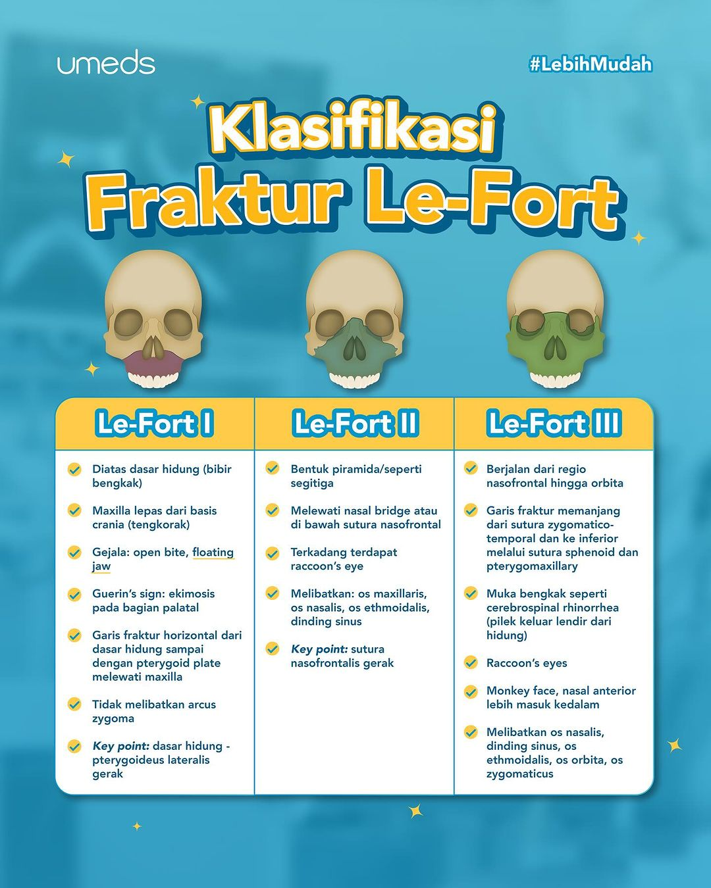

# 
Radiologi Kedokteran Gigi

[toc]

---

## Intraoral

- Periapikal
	- Pengukuran panjang gigi; derajat kehilangan gigi; melihat lesi periapikal; PSA
	- Jenis terbaik &rarr; Menggunakan film holder &rarr; Periapikal paralel
- Bitewing
	- Karies interproksimal; puncak tulang alveolar
- Oklusal
	- Lokasi akar gigi
	- Salivary stone (sialolithiasis)
	- Lokasi supernumerary
	- Lokasi C yang belum erupsi

### Oklusal - Maksila

- Topographic occ. projection
	- Pemeriksaan palatum & ante. maksila
- Lateral occ. projection
	- Pemeriksaan akar molar di palatal
	- Lesi pada palatum
- Pediatric occ. projection
	- Pemeriksaan gigi ante. pada pasien usia &le; 5th
 
### Oklusal - Mandibula

- Topographic occ. projection
	- Untuk gigi ante. mandibula
- Cross-sectional occ. projection
	- Untuk salivary stone pada dasar mulut &rarr; sialolithiasis
- Pediatric occ. projection
	- Pemeriksaan gigi ante. pada pasien usia &le; 5th

## Ekstraoral

- Panoramik
	- Menegakkan diagnosis
	- Evaluasi trauma
	- Evaluasi gigi terpendam (intrusi)
- Standard Occipital Water's
	- Deteksi fraktur wajah
	- Le Fort I, II, dan III

> :warning: **Klasifikasi Le Fort:**
>
> 
>
>  - Le Fort I &rarr; Floating jaw
> - Le Fort II &rarr; Raccoon's eye
> - Le Fort III &rarr; Battle sign

- Posteroanterior
	- Fraktur pada kubah tengkorak
	- Penyelidikan sinus frontalis
- Submentovertex
	- Posisi kondilus
	- Deteksi fraktur zygomatikus
- Reverse Towne
	- Anomali pada TMJ
- Sefalometri
	- Diagnosis ortodonti
 
---

## Efek radiologi

- Somatik &rarr; Terasa oleh individu yang terpapar radiasi
	- Stokastik &rarr; Fungsi & dosis radiasi yang diterima tanpa nilai ambang (*Threshold*)
		- Cancer :<
	- Non-stokastik/deterministik &rarr; Tingkat keparahan tergantung dosis
		- Katarak, eritema, impotensi :joy:
- Genetik &rarr; Dirasakan oleh keturunan

---

## Kegagalan

- Terlalu maju ke depan
	- Gigi ante. blur
	- Penyempitan di anterior
	- Premolar terlihat tumpang tindih
- Terlalu ke belakang
	- Ante. tampak lebar + tidak jelas
	- Mahkota melebar
	- Akar terpotong
- Kepala terpelintir/twisting
	- Elongasi mandibula
	- Ukuran gigi < pada satu sisi
- Head tilt too high
	- Bentuk occlusal plane concave
- Head tilt too low
	- Bentuk occlusal plane convex
 
- Developer &rarr; Menggelapkan
- Fixer &rarr; Mencerahkan
 
- Terlalu terang
	- Underdeveloped
	- Overfixed
	- Underexposed
- Terlalu gelap
	- Overdeveloped
	- Underfixed
	- Overexposed
 
- Tampak tin foil &rarr; Reversed film (film terbalik)
- Gambar tumpang tindih &rarr; Double exposed
- Tak tampak gambar &rarr; Unexposed

 

- SLOB / Tube Shifting / Clark's rule
	- Same Lingual, Opposite Buccal
	- Untuk melihat kecurigaan ada akar gigi lagi (Geligi molar)

---

## Lesi pada radiograf

### Lesi radiolusen

- Abses &rarr; Radiolusen diffuse
- Granuloma &rarr; Terlokalisir; < 10mm
- Kista &rarr; Jelas dan tegas; ukuran > 10mm
	- Kista dentigerous &rarr; Gigi impaksi; Di sekitar mahkota
	- Kista residual &rarr; Pasca pencabutan
	- Kista radikuler &rarr; Gigi nekrosis; Di sekitar apikal
	- Non odontogenik:
		- Kista nasopalatina &rarr; Heart-shaped :heart:
		- Kista globulomaksilaris &rarr; Pear-shaped :pear:
- Odontogenic Keratocyst &rarr; Tampak *scalloped border*
- Ameloblastoma &rarr; Keganasan; Menyebabkan resorbsi akar &rarr; Ada kegoyangan gigi
	- Seperti sarang lebah (honeycomb)
	- Bubble soap / busa sabun
	- Berlobus-lobus
	- DDx dari OKC
- Osteoradionecrosis &rarr; Karena radioterapi

### Lesi radiopak

- Odontoma
	- Compound odontoma &rarr; Dentikel gigi-gigi kecil :moyai:
	- Complex odontoma &rarr; Seperti kapas / bongkahan gigi besar
- Condensing osteitis &rarr; Radiopak diffuse
- Cementoma &rarr; Radiopak bulat di ujung apeks gigi anterior
- Cementoblastoma &rarr; Radiopak bulat di ujung apeks gigi posterior
- Hypercementosis &rarr; Akar terlihat membesar; Lig. periodontal normal
- Ankylosis &rarr; Akar terlihat membesar; Lig. periodontal tak normal
- Osteosarkoma &rarr; Sunray appearance
- Osteomyelitis
	- Kronis &rarr; Worm/moth-eaten
	- Garre &rarr; Onion-skin
	- Perawatan untuk osteomyelitis &rarr; Sekuesterektomi